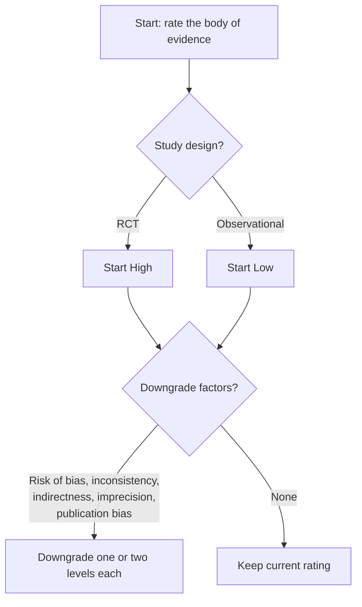

# Scientific Critical Thinking

## Overview

Critical thinking is a systematic process for evaluating scientific rigor. Assess methodology, experimental design, statistical validity, biases, confounding, and evidence quality using GRADE and Cochrane ROB frameworks. Apply this skill for critical analysis of scientific claims.

## When to Use This Skill

This skill should be used when:
- Evaluating research methodology and experimental design
- Assessing statistical validity and evidence quality
- Identifying biases and confounding in studies
- Reviewing scientific claims and conclusions
- Conducting systematic reviews or meta-analyses
- Applying GRADE or Cochrane risk of bias assessments
- Providing critical analysis of research papers

## Visual Aids (Optional)

Only add figures when the **user explicitly requests** a diagram (for example, a GRADE flowchart, bias decision tree, or evidence-quality framework).

**When figures help:**
- Critical thinking framework diagrams
- Bias identification decision trees
- Evidence quality assessment flowcharts
- GRADE or risk-of-bias evaluation frameworks

**How to create figures:** a Mermaid diagram in the document is usually enough for a
decision tree or a grading flowchart, and it stays editable as text alongside the
analysis. Reach for matplotlib only when the figure carries data.

````markdown

````

---

## Core Capabilities

Seven capability areas, each with the questions to ask and what the answers imply, are in
[references/core_capabilities.md](references/core_capabilities.md):

1. **Methodology critique** — design, controls, confounding, and whether the method can
   answer the question asked.
2. **Bias detection** — selection, measurement, publication, and cognitive biases.
3. **Statistical analysis evaluation** — power, multiplicity, p-value misuse, effect sizes.
4. **Evidence quality assessment** — study hierarchy, replication, and strength of inference.
5. **Logical fallacy identification** — the fallacies that recur in scientific argument.
6. **Research design guidance** — how to strengthen a design before data collection.
7. **Claim evaluation** — separating what was shown from what is being asserted.

Per-topic detail is in [references/scientific_method.md](references/scientific_method.md),
[references/common_biases.md](references/common_biases.md),
[references/statistical_pitfalls.md](references/statistical_pitfalls.md),
[references/evidence_hierarchy.md](references/evidence_hierarchy.md),
[references/logical_fallacies.md](references/logical_fallacies.md), and
[references/experimental_design.md](references/experimental_design.md).

## Application Guidelines

### General Approach

1. **Be Constructive**
   - Identify strengths as well as weaknesses
   - Suggest improvements rather than just criticizing
   - Distinguish between fatal flaws and minor limitations
   - Recognize that all research has limitations

2. **Be Specific**
   - Point to specific instances (e.g., "Table 2 shows..." or "In the Methods section...")
   - Quote problematic statements
   - Provide concrete examples of issues
   - Reference specific principles or standards violated

3. **Be Proportionate**
   - Match criticism severity to issue importance
   - Distinguish between major threats to validity and minor concerns
   - Consider whether issues affect primary conclusions
   - Acknowledge uncertainty in your own assessments

4. **Apply Consistent Standards**
   - Use same criteria across all studies
   - Don't apply stricter standards to findings you dislike
   - Acknowledge your own potential biases
   - Base judgments on methodology, not results

5. **Consider Context**
   - Acknowledge practical and ethical constraints
   - Consider field-specific norms for effect sizes and methods
   - Recognize exploratory vs. confirmatory contexts
   - Account for resource limitations in evaluating studies

### When Providing Critique

**Structure feedback as:**

1. **Summary:** Brief overview of what was evaluated
2. **Strengths:** What was done well (important for credibility and learning)
3. **Concerns:** Issues organized by severity
   - Critical issues (threaten validity of main conclusions)
   - Important issues (affect interpretation but not fatally)
   - Minor issues (worth noting but don't change conclusions)
4. **Specific Recommendations:** Actionable suggestions for improvement
5. **Overall Assessment:** Balanced conclusion about evidence quality and what can be concluded

**Use precise terminology:**
- Name specific biases, fallacies, and methodological issues
- Reference established standards and guidelines
- Cite principles from scientific methodology
- Use technical terms accurately

### When Uncertain

- **Acknowledge uncertainty:** "This could be X or Y; additional information needed is Z"
- **Ask clarifying questions:** "Was [methodological detail] done? This affects interpretation."
- **Provide conditional assessments:** "If X was done, then Y follows; if not, then Z is concern"
- **Note what additional information would resolve uncertainty**

## Reference Materials

This skill includes comprehensive reference materials that provide detailed frameworks for critical evaluation:

- **`references/scientific_method.md`** - Core principles of scientific methodology, the scientific process, critical evaluation criteria, red flags in scientific claims, causal inference standards, peer review, and open science principles

- **`references/common_biases.md`** - Comprehensive taxonomy of cognitive, experimental, methodological, statistical, and analysis biases with detection and mitigation strategies

- **`references/statistical_pitfalls.md`** - Common statistical errors and misinterpretations including p-value misunderstandings, multiple comparisons problems, sample size issues, effect size mistakes, correlation/causation confusion, regression pitfalls, and meta-analysis issues

- **`references/evidence_hierarchy.md`** - Traditional evidence hierarchy, GRADE system, study quality assessment criteria, domain-specific considerations, evidence synthesis principles, and practical decision frameworks

- **`references/logical_fallacies.md`** - Logical fallacies common in scientific discourse organized by type (causation, generalization, authority, relevance, structure, statistical) with examples and detection strategies

- **`references/experimental_design.md`** - Comprehensive experimental design checklist covering research questions, hypotheses, study design selection, variables, sampling, blinding, randomization, control groups, procedures, measurement, bias minimization, data management, statistical planning, ethical considerations, validity threats, and reporting standards

**When to consult references:**
- Load references into context when detailed frameworks are needed
- Use grep to search references for specific topics: `grep -r "pattern" references/`
- References provide depth; SKILL.md provides procedural guidance
- Consult references for comprehensive lists, detailed criteria, and specific examples

## Try it

A self-contained check that this skill's own claims still hold. No account, no key, nothing
to download beyond `numpy` and `scipy`.

**Data** — generated inline, and the frontmatter says so with `datasets: []` rather than
naming a source. That is deliberate rather than a shortcut. Two of the three checks below
need to know the *true* answer in order to show that a standard analysis gets it wrong, and
only simulation supplies that: the treatment effect in check 3 is exactly zero because no
effect term is ever added. The third check needs no generated data at all — it is the
published 2×2×2 table from Charig et al., *BMJ* 292:879–882 (1986), open surgery (A) versus
percutaneous nephrolithotomy (B) for kidney stones, typed in as four counts and evaluated by
exact arithmetic.

**Run**

```python
import numpy as np
from scipy import stats

rng = np.random.default_rng(20260817)

# 1. Multiplicity. Twenty tests, every null TRUE by construction — there is nothing
#    real in this data to find.
alpha, k, n, trials = 0.05, 20, 20, 10_000
p = stats.ttest_ind(rng.normal(size=(trials, k, n)),
                    rng.normal(size=(trials, k, n)), axis=2).pvalue
analytic = 1 - (1 - alpha) ** k
print("1. multiplicity — 20 tests, all nulls true")
print(f"   analytic FWER 1-(1-.05)^20  : {analytic:.4f}")
print(f"   simulated, uncorrected      : {(p < alpha).any(axis=1).mean():.4f}")
print(f"   simulated, Bonferroni       : {(p < alpha / k).any(axis=1).mean():.4f}")
print(f"   mean 'hits' per study       : {(p < alpha).sum(axis=1).mean():.2f}")
assert abs((p < alpha).any(axis=1).mean() - analytic) < 0.02
assert (p < alpha / k).any(axis=1).mean() <= alpha

# 2. Simpson's paradox. Published counts, exact arithmetic, no RNG.
tbl = {"small (<2 cm)": {"A": (81, 87), "B": (234, 270)},
       "large (>=2 cm)": {"A": (192, 263), "B": (55, 80)}}
print("\n2. Simpson's paradox — same data, opposite conclusion")
for stratum, arm in tbl.items():
    ra, rb = arm["A"][0] / arm["A"][1], arm["B"][0] / arm["B"][1]
    print(f"   {stratum:14s} A {arm['A'][0]:3d}/{arm['A'][1]:3d} = {ra:.3f}"
          f"   B {arm['B'][0]:3d}/{arm['B'][1]:3d} = {rb:.3f}   A-B = {ra - rb:+.3f}")
    assert ra > rb, "A wins in this stratum"
tot = {a: (sum(s[a][0] for s in tbl.values()), sum(s[a][1] for s in tbl.values()))
       for a in ("A", "B")}
pa, pb = tot["A"][0] / tot["A"][1], tot["B"][0] / tot["B"][1]
print(f"   {'pooled':14s} A {tot['A'][0]:3d}/{tot['A'][1]:3d} = {pa:.3f}"
      f"   B {tot['B'][0]:3d}/{tot['B'][1]:3d} = {pb:.3f}   A-B = {pa - pb:+.3f}")
assert pa < pb, "B wins pooled — the reversal"

# 3. Regression to the mean. The treatment does exactly nothing: `follow` is drawn
#    without any effect term at all.
N, sigma = 20_000, 0.7
trait = rng.normal(size=N)
base = trait + rng.normal(scale=sigma, size=N)
follow = trait + rng.normal(scale=sigma, size=N)
arm = rng.permutation(np.r_[np.ones(N // 2), np.zeros(N // 2)]).astype(bool)
enrolled = base > np.quantile(base, 0.90)
chg = follow - base
d_t, d_c = chg[enrolled & arm].mean(), chg[enrolled & ~arm].mean()
_, pval = stats.ttest_rel(follow[enrolled & arm], base[enrolled & arm])
print("\n3. regression to the mean — true effect is 0 by construction")
print(f"   enrolled (worst decile at baseline) : {int(enrolled.sum())}")
print(f"   single-arm pre-post, treated        : {d_t:+.3f}   p = {pval:.1e}")
print(f"   same window, randomized controls    : {d_c:+.3f}")
print(f"   controlled estimate (t - c)         : {d_t - d_c:+.3f}")
assert d_t < -0.5 and pval < 1e-10
assert abs(d_t - d_c) < 0.20

print("\nall checks passed")
```

**Expect**

Invariants — these are properties of the arithmetic and of the sampling model, not of a
package version. A failure here means this skill is **wrong**, not that something drifted:

- **The family-wise error rate is 1 − (1 − α)^k, and it is not small.** Twenty independent
  tests at α = 0.05 with every null true give a 0.6415 chance of at least one "significant"
  result, and one such result per study on average. Bonferroni pulls the family-wise rate
  back to at or below α. This is Pitfall 6 in `references/statistical_pitfalls.md` and
  fallacy 27 in `references/logical_fallacies.md` made numerical.
- **A treatment can win in every stratum and lose overall.** Treatment A beats B for small
  stones and for large stones, and loses on the pooled table — because stone size is
  distributed unevenly across the arms. The reversal is exact, not marginal, and no amount
  of precision on the pooled estimate would reveal it. That is Pitfall 17.
- **A confident p-value is not evidence of an effect.** Recruiting the worst decile at
  baseline and comparing before with after yields a large, overwhelmingly "significant"
  improvement from a process in which the treatment does *nothing whatsoever*. The
  randomized control arm improves by the same amount, and the controlled contrast recovers
  roughly zero. This is bias 22 in `references/common_biases.md`, and it is why a
  single-arm pre-post design cannot support a treatment claim no matter how small its
  p-value is.

Observed 2026-08-17 with NumPy 2.4.6, SciPy 1.17.1, Python 3.11.15. The run is seeded and
reproducible; the simulated figures depend on NumPy's generator stream, so if those move
slightly treat it as drift to investigate, not as a failure. The Simpson's block contains no
randomness and its numbers cannot move at all.

```
1. multiplicity — 20 tests, all nulls true
   analytic FWER 1-(1-.05)^20  : 0.6415
   simulated, uncorrected      : 0.6438
   simulated, Bonferroni       : 0.0464
   mean 'hits' per study       : 1.00

2. Simpson's paradox — same data, opposite conclusion
   small (<2 cm)  A  81/ 87 = 0.931   B 234/270 = 0.867   A-B = +0.064
   large (>=2 cm) A 192/263 = 0.730   B  55/ 80 = 0.688   A-B = +0.043
   pooled         A 273/350 = 0.780   B 289/350 = 0.826   A-B = -0.046

3. regression to the mean — true effect is 0 by construction
   enrolled (worst decile at baseline) : 2000
   single-arm pre-post, treated        : -0.694   p = 2.0e-103
   same window, randomized controls    : -0.754
   controlled estimate (t - c)         : +0.060

all checks passed
```

The single-arm result in check 3 is the one to sit with: `p = 2e-103` for an effect that is
zero by construction. Nothing about that p-value is wrong — it correctly rejects the null
that the *selected* group's two measurements have the same mean, which was never the
question. The design, not the statistic, is what fails.

---

## Remember

**Scientific critical thinking is about:**
- Systematic evaluation using established principles
- Constructive critique that improves science
- Proportional confidence to evidence strength
- Transparency about uncertainty and limitations
- Consistent application of standards
- Recognition that all research has limitations
- Balance between skepticism and openness to evidence

**Always distinguish between:**
- Data (what was observed) and interpretation (what it means)
- Correlation and causation
- Statistical significance and practical importance
- Exploratory and confirmatory findings
- What is known and what is uncertain
- Evidence against a claim and evidence for the null

**Goals of critical thinking:**
1. Identify strengths and weaknesses accurately
2. Determine what conclusions are supported
3. Recognize limitations and uncertainties
4. Suggest improvements for future work
5. Advance scientific understanding
